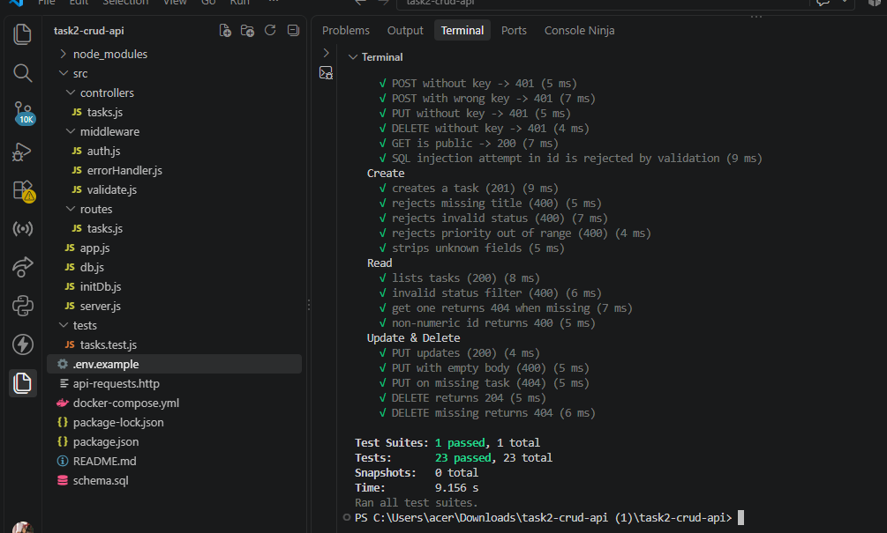
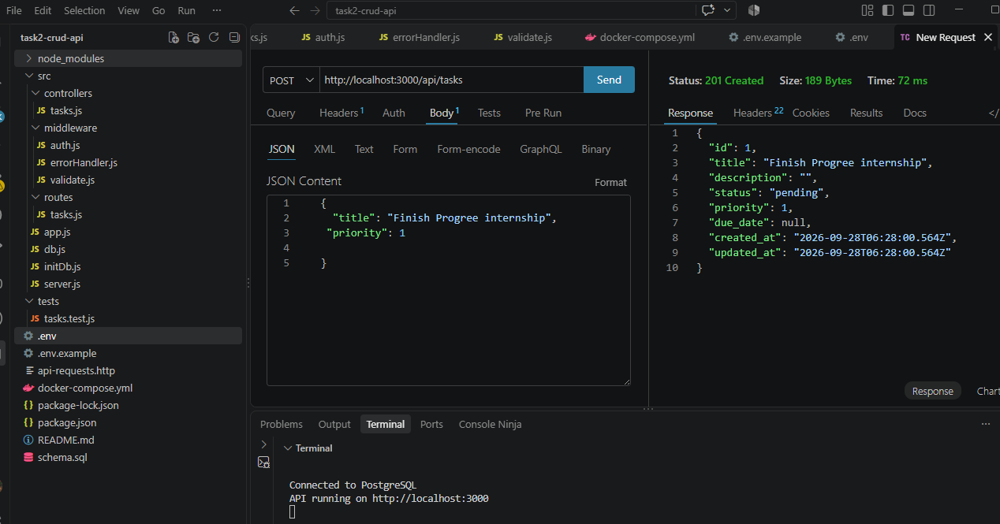
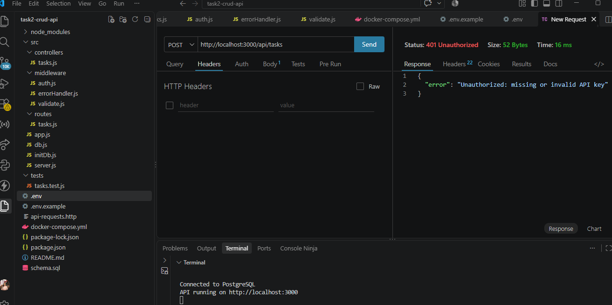
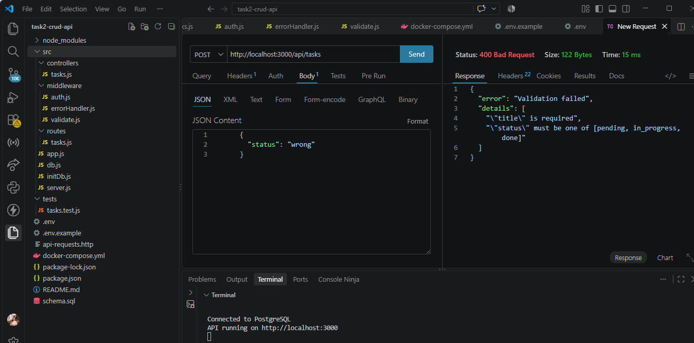
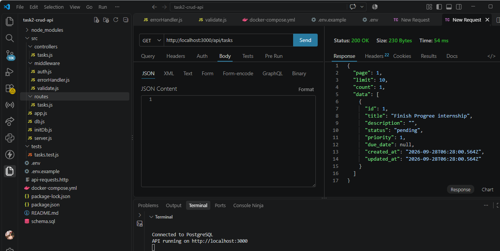
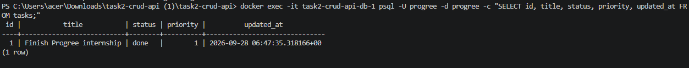
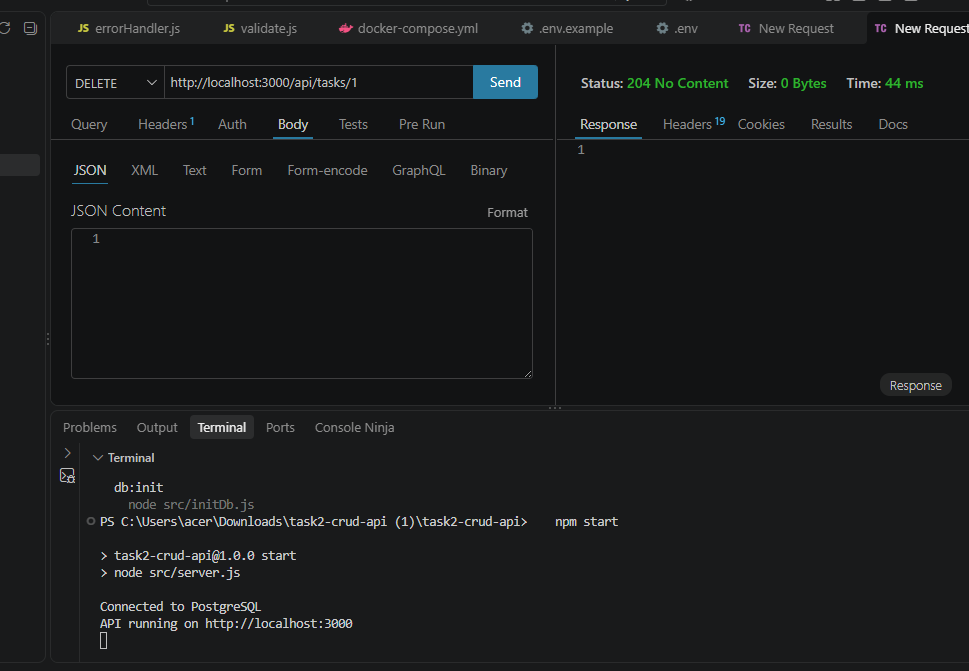

# Task 2 – Secured RESTful CRUD API (Node.js + Express + PostgreSQL)

## Features
- Express 4 server, PostgreSQL via `pg` (connection pool, parameterised queries)
- SQL schema in `schema.sql` (constraints, CHECKs, index)
- Full CRUD for a `tasks` resource, with pagination and status filter
- **Validation middleware (Joi)** for body, query and URL params; unknown fields stripped
- **Security:** API-key protection on all mutations (constant-time compare), helmet,
  CORS, rate limiting, body-size limit, SQL-injection-safe queries, central error handler
- Automated tests (Jest + Supertest)

## Project structure
```
src/
  app.js                    Express app (middleware stack + routes)
  server.js                 Startup: checks env + DB connection
  db.js / initDb.js         PostgreSQL pool / schema creation
  routes/tasks.js           Endpoint routing
  controllers/tasks.js      CRUD logic
  middleware/validate.js    Joi validation middleware + schemas
  middleware/auth.js        API-key security middleware
  middleware/errorHandler.js
tests/tasks.test.js         Automated endpoint tests
schema.sql                  Relational schema
api-requests.http           Ready-made requests (REST Client / Postman)
```

## Screenshots

### Automated tests (23 passing)


### Create a task, 201 Created


### Missing API key, 401 Unauthorized


### Invalid data, 400 Bad Request


### List tasks, 200 OK


### Data stored in PostgreSQL


### Delete a task, 204 No Content


## Run
```bash
docker compose up -d          # PostgreSQL
cp .env.example .env          # then set API_KEY to your own secret
npm install
npm run db:init               # creates the tables
npm start                     # http://localhost:3000
npm test
```

## Endpoints
| Method | Path | Auth | Description |
|---|---|---|---|
| GET | /health | – | Health check |
| GET | /api/tasks?status=&page=&limit= | – | List tasks |
| GET | /api/tasks/:id | – | Get one |
| POST | /api/tasks | x-api-key | Create task |
| PUT/PATCH | /api/tasks/:id | x-api-key | Update (any subset of fields) |
| DELETE | /api/tasks/:id | x-api-key | Delete |

## Status codes
200 OK · 201 Created · 204 Deleted · 400 Validation error · 401 Bad/missing key · 404 Not found · 429 Rate limited · 500 Server error

## Try it
```bash
curl -X POST localhost:3000/api/tasks -H "Content-Type: application/json" \
  -H "x-api-key: YOUR_KEY" -d '{"title":"Finish internship","priority":1}'
curl localhost:3000/api/tasks
curl -X PUT localhost:3000/api/tasks/1 -H "Content-Type: application/json" \
  -H "x-api-key: YOUR_KEY" -d '{"status":"done"}'
curl -X DELETE localhost:3000/api/tasks/1 -H "x-api-key: YOUR_KEY"
```
